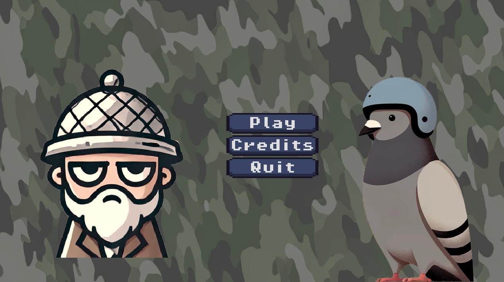
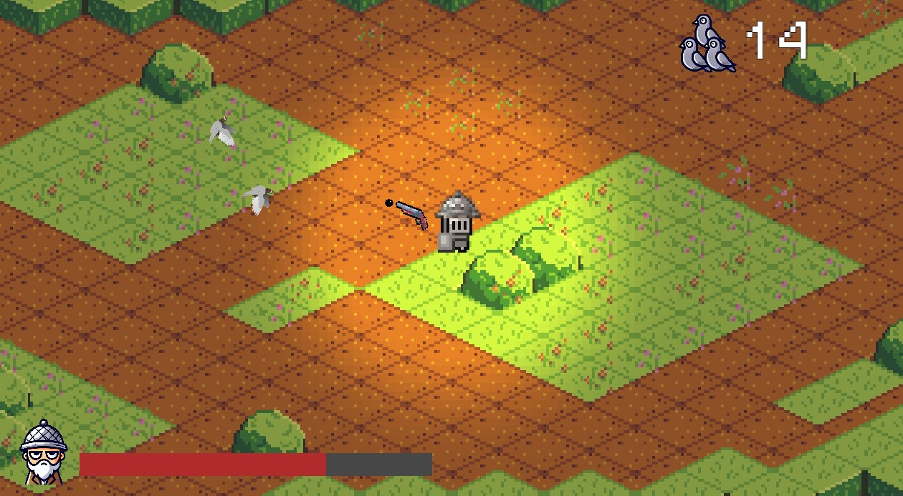

# 🕊️ Pigeons with Helmets 🪖





## 🧠 Introduction

**Pigeons with Helmets** is a simple yet strategic action game developed using **GDScript**, a Python-based programming language, within the **Godot** game engine.

The objective? Outsmart a rogue soldier (an enemy of the government) who has gone bad and now continuously shoots at innocent pigeons. Your mission is to **spawn pigeons strategically** and eliminate the soldier using the **least number of pigeons possible**.


## 🚀 Getting Started

To get the game running on your machine, follow these steps:

#### 1. Download Godot Engine :
This game is built with the **Godot Engine**, so you'll need it installed to run or edit the game.

- Download it from the official site: [https://godotengine.org/download](https://godotengine.org/download)
- Recommended version:**4.4.1** 


#### 2. Clone or Download the Game

You can either clone this repository or download it as a ZIP file:

```bash
git clone https://github.com/your-username/pigeons-with-helmets.git
cd prototype
```

#### 3. Open the game using Godot engine : 
You can open the repository in the game engine and start playing on the engine. 


## Assets used 

- [tilesets](https://je1ly.itch.io/isometrictilemap)
- [camo_color_for_UI](https://megabyte-games.itch.io/pattern-pack-chromatic-camouflage?download)
- [buttons_pack](https://slyfox-studios.itch.io/buttons-pack)
- [bullet](https://dinopixel.com/bullet-pixel-art-42595)

